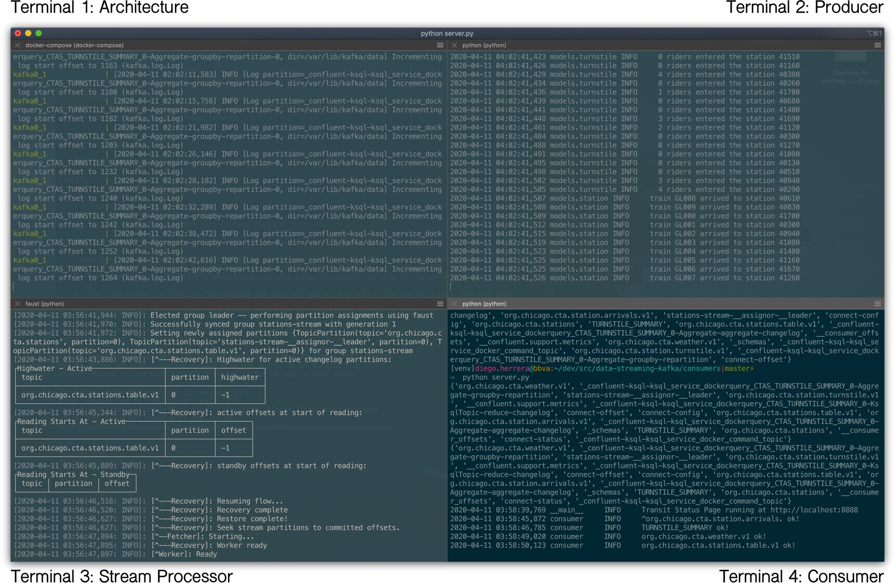
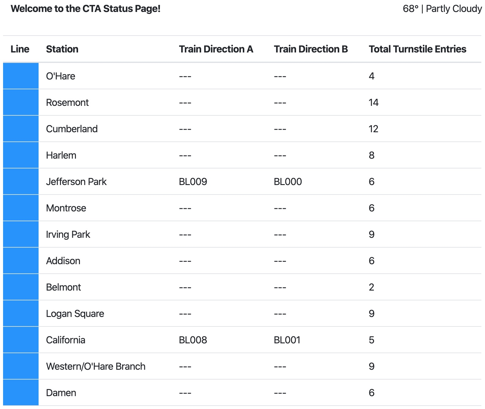

# Public Transit Status with Apache Kafka

In this project, we will construct a streaming event pipeline around Apache Kafka and its ecosystem. Using public data from the [Chicago Transit Authority](https://www.transitchicago.com/data/) we will construct an event pipeline around Kafka that allows us to simulate and display the status of train lines in real time.

When the project is complete, we will be able to monitor a website to watch trains move from station to station.

## Table of contents

- [Structure](#structure)
- [Requirements](#requirements)
  - [Cloning the repository](#cloning-the-repository)
  - [Preparing the environment](#preparing-the-environment)
    - [Terminal 1: Architecture](#terminal-1-architecture)
    - [Terminal 2: Producer](#terminal-2-producer)
    - [Terminal 3: Stream Processor](#terminal-3-stream-processor)
    - [Terminal 4: Consumer](#terminal-4-consumer)
- [How to use](#how-to-use)
  - [Stopping the solution](#stopping-the-solution)

---

## Structure<a name="structure"></a>

This tree shows the repository structure.

```
.
├── consumers
│   ├── models
│   │   ├── __init__.py
│   │   ├── line.py
│   │   ├── lines.py
│   │   ├── station.py
│   │   └── weather.py
│   ├── templates
│   │   └── status.html
│   ├── __init__.py
│   ├── constants.py
│   ├── consumer.py
│   ├── faust_stream.py
│   ├── ksql.py
│   ├── logging.ini
│   ├── requirements.txt
│   ├── server.py
│   └── utils.py
├── images
│   ├── cta-status-page.jpg
│   └── solution.jpg
├── producers
│   ├── data
│   │   ├── cta_stations.csv
│   │   ├── ridership_curve.csv
│   │   └── ridership_seed.csv
│   ├── models
│   │   ├── schemas
│   │   │   ├── arrival_key.json
│   │   │   ├── arrival_value.json
│   │   │   ├── turnstile_key.json
│   │   │   ├── turnstile_value.json
│   │   │   ├── weather_key.json
│   │   │   └── weather_value.csv
│   │   ├── __init__.py
│   │   ├── line.py
│   │   ├── producer.py
│   │   ├── station.py
│   │   ├── train.py
│   │   ├── turnstile_hardware.py
│   │   ├── turnstile.py
│   │   └── weather.py
│   ├── __init__.py
│   ├── connector.py
│   ├── constants.py
│   ├── consumer.py
│   ├── faust_stream.py
│   ├── ksql.py
│   ├── logging.ini
│   ├── requirements.txt
│   ├── server.py
│   └── utils.py
├── .editorconfig
├── .gitignore
├── docker-compose.yaml
├── load_stations.sql
└── README.md
```

---

## Requirements<a name="requirements"></a>

It is assumed that you have a computer with at least **16GB RAM** and **4-core CPU**, and tools below are properly installed locally:

- Python 3.7
- Docker Engine / Desktop + Docker Compose

### Cloning the repository<a name="cloning-the-repository"></a>

The first step is to clone this repository. Just type the following command in your terminal:

```bash
# Clone the repository...
$ git clone https://github.com/vermicida/data-streaming-kafka.git

# ...and move to its directory
$ cd data-streaming-kafka
```

### Preparing the environment<a name="preparing-the-environment"></a>

We need multiple terminal sessions in order to run the project:

- A session to to run the architecture of the solution, consisting in:
  - A 3-node kafka cluster
  - A 1-zookeeper ensemble
  - Schema Registry
  - Kafka REST Proxy
  - Kafka Connect
- A session to run the simulator that produces events randomly
- A session to process the streams
- A session to run the server that consume the data and shows it in a web dashboard

#### Terminal 1: Architecture<a name="terminal-1-architecture"></a>

Open a new terminal session, or use the one you just used to clone the respository. From the root folder of the project, run the following command:

```bash
$ docker-compose up --force-recreate --build
```

Docker will run the services defined in the file `docker-compose.yaml`. If any of the images isn't found locally, Docker will download it. This process take awhile, so be patient; 10-15 minutes based on your internet connection and hardware.

#### Terminal 2: Producer<a name="terminal-2-producer"></a>

We are going to prepare the Producer environment. Create a new terminal session and run these commands:

```bash
# Move to directory producers
$ cd producers

# Create a virtualenv and activate it
$ virtualenv venv
$ source venv/bin/activate

# Install the dependencies
$ pip install -r requirements.txt
```

This session is ready now; we will be back here in a few minutes.

#### Terminal 3: Stream Processor<a name="terminal-3-stream-processor"></a>

It's the turn to prepare the Stream Processor environment. Just as we did in the previous step, create a new terminal session; then run the commands below:

```bash
# Move to directory consumers
$ cd consumers

# Create a virtualenv and activate it
$ virtualenv venv
$ source venv/bin/activate

# Install the dependencies
$ pip install -r requirements.txt
```

Another session ready. Let's prepare the last one.

#### Terminal 4: Consumer<a name="terminal-4-consumer"></a>

In this terminal session we will operate over the directory `consumers`; we just prepared the environment in that directory, so we must do nothing more that open the session and move to the directory:

```bash
# Move to directory consumers
$ cd consumers
```

Now we are ready to run all the pieces.

---

## How to use<a name="how-to-use"></a>

Once the Producer, Stream Processor and Consumer environments are set, we must execute the following commands in the corresponding session:

- In **Terminal 1** we already have the architecture running, so nothing left to do here.
- We must run the Producer in **Terminal 2**:

```bash
$ python simulation.py
```

- Stream Processor has work to do, so we must initialize it now in **Terminal 3**:

```bash
$ faust -A faust_stream worker -l info
```

- It's time to create some tables in KSQL; let's do it in **Terminal 4**:

```bash
$ python ksql.py
```

- And last but not least, the Consumer. Also in **Terminal 4** run this command:

```bash
$ python server.py
```

At this point, you must have something like this:



Now, open your browser and navigate to `http://localhost:8888`. You will see the CTA Status Page, a dashboard showing live info about stations, trains and passengers.



Let all the terminal sessions working for a few minutes to see how the dashboard is automatically updated when new events are processed.

### Stopping the solution<a name="stopping-the-solution"></a>

To stop all the running processes we will go in reverse order:

- In **Terminal 4**, hit `Ctrl` + `C`.
- In **Terminal 3**, hit `Ctrl` + `C`.
- In **Terminal 2**, hit `Ctrl` + `C`.
- In **Terminal 1**, hit `Ctrl` + `C`. When Docker Compose stops all the services, make sure to also remove the containers running the following command:

```bash
$ docker-compose down
```
